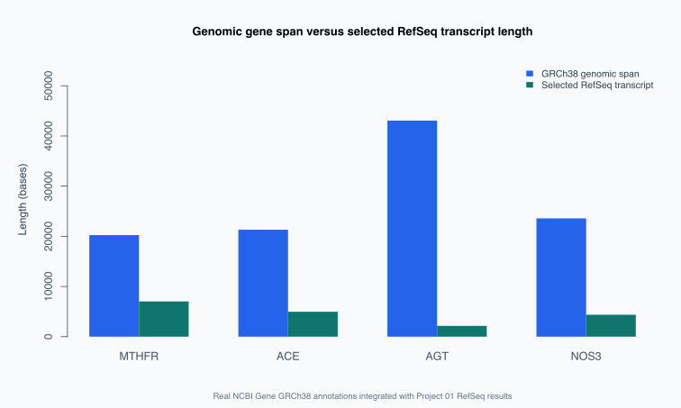

# Comparative Genomic Annotation and Gene-Transcript Structure Analysis

## Project overview

Comparative analysis of four genuine human NCBI Gene records and the versioned
RefSeq transcript measurements produced in Project 01. The project integrates
GRCh38 genomic coordinates, chromosome assignments, strand orientation, exon
counts, Ensembl cross-references, transcript lengths, and transcript GC content
into a reproducible R-based analytical workflow.

## Analytical question

How do the genomic locations, annotated structural characteristics, and genomic-
to-transcript length relationships of MTHFR, ACE, AGT, and NOS3 differ on the
GRCh38 human reference assembly?

## Public datasets

### Primary source: NCBI Gene

| Gene | NCBI Gene ID | Official source | GRCh38 chromosome accession | Ensembl cross-reference |
| --- | ---: | --- | --- | --- |
| MTHFR | 4524 | [NCBI Gene: MTHFR](https://www.ncbi.nlm.nih.gov/gene/4524) | NC_000001.11 | ENSG00000177000 |
| ACE | 1636 | [NCBI Gene: ACE](https://www.ncbi.nlm.nih.gov/gene/1636) | NC_000017.11 | ENSG00000159640 |
| AGT | 183 | [NCBI Gene: AGT](https://www.ncbi.nlm.nih.gov/gene/183) | NC_000001.11 | ENSG00000135744 |
| NOS3 | 4846 | [NCBI Gene: NOS3](https://www.ncbi.nlm.nih.gov/gene/4846) | NC_000007.14 | ENSG00000164867 |

Reference assembly: **GRCh38.p14**, accession `GCF_000001405.40`.

Direct machine-readable access:

https://eutils.ncbi.nlm.nih.gov/entrez/eutils/esummary.fcgi?db=gene&id=4524,1636,183,4846&retmode=json

The analysis requests all four genuine records in one NCBI ESummary API call.
For reproducibility without an internet connection,
`tests/fixtures/verified_ncbi_gene_annotations.csv` contains a clearly labeled,
source-verifiable subset copied from the four official NCBI Gene records. It is
real annotation data, not simulated or invented data.

### Secondary source: Project 01 RefSeq results

The analysis integrates the genuine transcript measurements in:

```text
../genomics-practice-01-python-gc-content-refseq/outputs/gc_content_results.csv
```

| Gene | Versioned RefSeq accession | Transcript length (nt) | GC content (%) |
| --- | --- | ---: | ---: |
| MTHFR | NM_005957.5 | 7,018 | 57.11 |
| ACE | NM_000789.4 | 4,962 | 60.40 |
| AGT | NM_001382817.3 | 2,148 | 54.61 |
| NOS3 | NM_000603.5 | 4,366 | 62.57 |

### Data usage

NCBI does not impose its own restrictions on the use or redistribution of
molecular database content, while noting that third parties or countries of
origin may assert additional rights. Attribute the original source and review
the [NCBI data-use policy](https://www.ncbi.nlm.nih.gov/home/about/policies/).

## Analytical approach

1. Retrieve the four version-traceable human NCBI Gene records in one request.
2. Validate the expected gene symbol, organism, and GRCh38 chromosome accession.
3. Convert zero-based NCBI Gene ESummary positions to one-based genomic
   coordinates and correctly identify plus- and minus-strand genes.
4. Calculate inclusive genomic span and retain the reported gene-level exon
   count, cytogenetic band, Ensembl cross-reference, and reference assembly.
5. Integrate the Project 01 RefSeq accession, transcript length, and GC content.
6. Calculate the genomic-to-transcript ratio, descriptive transcript fraction,
   and annotated exon density per 10,000 genomic bases.
7. Export a structured CSV, professional Markdown report, and comparative SVG
   visualization.
8. Validate source-backed coordinates, data integration, and failure handling
   using a base-R automated test suite.

## Coordinate-system quality control

NCBI Gene summary coordinates use a **zero-based** convention. Human-readable
genomic coordinates are ordinarily reported using a **one-based** convention.
In addition, minus-strand genes are represented with a biological `ChrStart`
greater than `ChrStop`.

The analysis therefore applies:

```text
one-based start = min(ChrStart, ChrStop) + 1
one-based end   = max(ChrStart, ChrStop) + 1
genomic span    = abs(ChrStop - ChrStart) + 1
strand          = "+" when ChrStart <= ChrStop; otherwise "-"
```

NCBI documents these zero-based coordinates and minus-strand ordering in its
[official Entrez Direct Gene sequence documentation](https://www.ncbi.nlm.nih.gov/books/NBK179288/).

## Requirements

- R, accessible from the terminal as `Rscript`.
- The `jsonlite` R package for live NCBI Gene ESummary requests.
- The existing Project 01 results CSV in the same repository.
- Internet access for live retrieval; the documented real-data snapshot also
  supports an offline execution mode without external R packages.

Install `jsonlite`:

```bash
Rscript -e 'install.packages("jsonlite", repos="https://cloud.r-project.org")'
```

## Reproduce the analysis

From this project directory:

```bash
Rscript analyze_gene_annotations.R --email your-real-email@example.com
```

To analyze the explicitly documented genuine NCBI Gene snapshot offline:

```bash
Rscript analyze_gene_annotations.R --offline-fixture
```

Run automated checks:

```bash
Rscript tests/test_gene_annotations.R
```

The contact email is supplied only to NCBI for live API requests; it is not
embedded in the repository or written to project output files.

## Output files

| File | Content |
| --- | --- |
| `outputs/gene_annotation_results.csv` | Integrated gene coordinates, assembly, exon counts, RefSeq accessions, transcript lengths, GC content, and derived structural metrics |
| `outputs/gene_structure_report.md` | Ranked structural findings and interpretation limitations |
| `outputs/gene_vs_transcript_lengths.svg` | Comparative visualization of genomic span and selected transcript length |
| `outputs/ncbi_gene_esummary.json` | Original NCBI response, created when the live API workflow is run |

## Verified results

| Gene | Chromosome | GRCh38 position | Strand | Exons | Genomic span (bp) | RefSeq transcript (nt) | Span/transcript |
| --- | --- | --- | --- | ---: | ---: | ---: | ---: |
| MTHFR | 1 | 11,785,723-11,805,964 | - | 13 | 20,242 | 7,018 | 2.88 |
| ACE | 17 | 63,477,061-63,498,373 | + | 26 | 21,313 | 4,962 | 4.30 |
| AGT | 1 | 230,702,523-230,745,583 | - | 6 | 43,061 | 2,148 | 20.05 |
| NOS3 | 7 | 150,991,017-151,014,588 | + | 28 | 23,572 | 4,366 | 5.40 |



- AGT has the largest observed genomic span and the highest genomic-to-
  transcript length ratio in this four-gene comparison.
- NOS3 has the highest annotated gene-level exon count.
- MTHFR and AGT are located on the minus strand; ACE and NOS3 are located on the
  plus strand.
- MTHFR and AGT are both on chromosome 1, but at distinct cytogenetic locations.

## Interpretation and limitations

The genomic interval includes the complete annotated chromosome span, whereas
the transcript measurement represents one selected processed RefSeq RNA.
Consequently, the genomic-to-transcript ratio is a descriptive structural
comparison, not an estimate of expression, intron count, total exon coverage,
pathogenicity, or disease risk.

The NCBI Gene exon count describes the gene-level annotation and does not
necessarily correspond to the exon count of the particular RefSeq transcript
selected in Project 01. Different transcript isoforms, annotation releases, or
genome assemblies may yield different structural measurements.

## Methods demonstrated

- Retrieval and validation of genuine public genomic annotation records.
- Assembly-aware interpretation of versioned chromosome accessions.
- Conversion between zero-based API positions and one-based genomic coordinates.
- Correct handling of plus- and minus-strand gene orientation.
- Integration of independent real NCBI Gene and RefSeq datasets.
- Reproducible feature engineering and comparative genomic visualization in R.
- Source-backed offline fixtures and automated data-integrity checks.
- Scientifically cautious interpretation of structural genomics findings.

## References

- NCBI Gene: https://www.ncbi.nlm.nih.gov/gene/
- NCBI RefSeq: https://www.ncbi.nlm.nih.gov/refseq/
- NCBI E-utilities documentation: https://www.ncbi.nlm.nih.gov/books/NBK25499/
- NCBI Entrez Direct coordinate documentation: https://www.ncbi.nlm.nih.gov/books/NBK179288/
- NCBI data-use policy: https://www.ncbi.nlm.nih.gov/home/about/policies/
