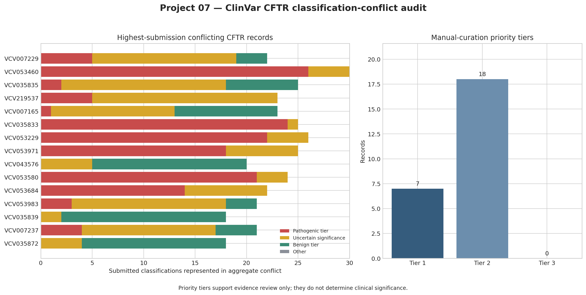

# Project 07: CFTR ClinVar Classification-Conflict Audit

## Project overview

This project builds a reproducible evidence-review queue for **CFTR** variants that
have conflicting germline classifications in NCBI ClinVar. It queries the live
database, separates condition-level search matches from records whose aggregate
VCV classification is explicitly conflicting, selects the 25 records with the
largest numbers of supporting submissions, and validates each selected VCV
archive before analysis.

The resulting priority tiers identify records that warrant early manual evidence
reconciliation. They are operational review categories, not clinical variant
classifications.

## Analytical question

Among current CFTR records with an aggregate ClinVar classification of
`Conflicting classifications of pathogenicity`, which high-submission variants
show pathogenic-versus-benign polarization, and what data-quality or review
features should guide manual curation priority?

## Biological and clinical context

CFTR encodes an anion channel. Pathogenic variation can cause cystic fibrosis and
other CFTR-related disorders, but variant effects may depend on phenotype,
inheritance, and the evidence available to individual submitters. ClinVar
aggregates submitted interpretations and exposes disagreement through its
classification and review-status fields. A conflicting aggregate record therefore
signals a need for evidence reconciliation; it does not establish which submitted
interpretation is correct.

## Data source

- **Database:** [NCBI ClinVar](https://www.ncbi.nlm.nih.gov/clinvar/)
- **Snapshot date:** 2026-09-28
- **Exact query:** `CFTR[gene] AND "conflicting classifications of pathogenicity"[clinsig]`
- **Programmatic interfaces:** ClinVar `esearch`, `esummary`, and `efetch` through
  [NCBI E-utilities](https://www.ncbi.nlm.nih.gov/clinvar/docs/programmatic_access/)
- **Query matches:** 549
- **Matches with the exact aggregate germline conflict label:** 407
- **Analyzed subset:** 25 current VCV records with the most supporting SCV
  accessions; ties were resolved by versioned VCV accession
- **Pinned record list:** [`data/source_manifest.json`](data/source_manifest.json)

The source manifest records every versioned VCV accession and direct ClinVar page
used in the committed analysis.

## Reference and data-quality assessment

The pipeline applies the following checks:

1. every search identifier has a complete ESummary response;
2. the record contains a versioned `VCV` accession and a CFTR gene assignment;
3. the ESummary aggregate germline label exactly matches the requested conflict;
4. the full VCV XML resolves with `RecordStatus` equal to `current`;
5. the XML version agrees with the version returned by ESummary;
6. a current GRCh38 location is identified when present; and
7. classification-count strings are parsed only when they match the expected
   ClinVar structure.

All 25 selected records passed the current-record check and had a current GRCh38
coordinate. Retired, previous, or otherwise non-current VCV records are rejected.

## Data usage

NCBI provides ClinVar as an unrestricted-access molecular database. NCBI states
that it places no restrictions on use or distribution of molecular data, while
also noting that third parties may claim rights over some submitted material.
This repository redistributes only a compact parsed snapshot and one XML fixture,
attributes NCBI ClinVar, links to the original records, and does not reproduce
submitter documents. See the
[NCBI data-usage policies](https://www.ncbi.nlm.nih.gov/home/about/policies/).

No patient-level or identifiable information is used.

## Methods

The analysis:

- retrieves the complete query result set;
- filters on the exact aggregate germline classification;
- ranks eligible records by supporting SCV count;
- retrieves and validates the full XML for the leading 25 records;
- extracts versioned identifiers, GRCh38 coordinates, HGVS-related fields,
  molecular consequences, review status, evaluation date, traits, PubMed IDs,
  reported allele frequencies, and submission counts;
- groups submitted classifications into pathogenic tier, uncertain significance,
  benign tier, and other;
- flags pathogenic-tier versus benign-tier polarization; and
- assigns transparent manual-curation tiers.

The complete implementation and decision rules are documented in
[`ANALYSIS_WORKFLOW.md`](ANALYSIS_WORKFLOW.md).

## Results

The 25 selected VCV records were all current, had current GRCh38 coordinates, and
had criteria-provided aggregate review status. Their median aggregate submission
count was **25**, with a maximum of **35**.

- **7 records** had pathogenic-tier and benign-tier submissions represented in
  the same aggregate conflict and met Tier 1 criteria.
- **18 records** met Tier 2 criteria: multi-submitter, criteria-provided conflicts
  without pathogenic-versus-benign polarization.
- **0 records** were more than five years past their aggregate last-evaluated date.
- The subset contained **20 missense**, **4 synonymous**, and **1 intronic**
  variant consequence annotations.

The five records with the largest aggregate submission counts were
`VCV000007229.102`, `VCV000053460.80`, `VCV000035835.90`,
`VCV000219537.98`, and `VCV000007165.98`.



## Interpretation

The audit identifies a concentrated manual-review workload among well-submitted
CFTR variants. Seven records cross the pathogenic-to-benign boundary, making them
particularly important candidates for condition-specific review of individual
SCV evidence. Submission counts are not votes, however: a larger count does not
make one interpretation correct, and different assertions may refer to different
conditions or evidence dates.

These outputs support curation planning only. They must not be used to diagnose a
patient, select treatment, or replace current expert-panel guidance.

## Output files

| File | Description |
| --- | --- |
| `data/source_manifest.json` | Query, snapshot date, inclusion rule, versioned VCV accessions, and direct record links |
| `outputs/cftr_conflicting_variants.csv` | Validated record-level audit table |
| `outputs/conflict_classification_counts.csv` | Long-format classification composition for each VCV record |
| `outputs/conflict_audit_summary.csv` | Compact verified result summary |
| `outputs/clinvar_conflict_audit_report.md` | Generated analytical report |
| `outputs/clinvar_conflict_audit.png` | Raster overview figure |
| `outputs/clinvar_conflict_audit.svg` | Vector overview figure |

## Reproducibility

Python 3.10 or newer is recommended.

```bash
cd genomics-practice-07-python-clinvar-conflict-audit
python3 -m venv .venv
source .venv/bin/activate
python3 -m pip install -r requirements.txt
python3 analyze_clinvar_conflicts.py
python3 -m unittest discover -s tests -v
```

An email may be supplied to NCBI as a contact parameter if desired:

```bash
python3 analyze_clinvar_conflicts.py --email name@example.org
```

ClinVar is updated weekly. A live rerun can therefore return newer accession
versions or a different top-25 subset. The committed outputs and source manifest
preserve the verified 2026-09-28 result.

## Technical competencies demonstrated

- NCBI E-utilities retrieval with retry handling and request pacing
- staged API querying and deterministic subset selection
- XML and JSON parsing
- variant-accession and genome-build validation
- classification-conflict decomposition
- transparent rule-based prioritization
- reproducible CSV, Markdown, PNG, and SVG reporting
- automated testing against an authentic ClinVar XML record
- scientifically cautious interpretation of clinical genomic evidence

## Limitations

- The project analyzes a high-submission subset rather than all eligible records.
- ClinVar aggregates submitted assertions and does not independently adjudicate
  every classification.
- Aggregate counts may combine condition-specific assertions and should not be
  interpreted as independent votes.
- Maximum reported allele frequency combines sources represented in the VCV XML;
  it is not a population-specific frequency analysis.
- Priority tiers are pre-specified workflow rules, not clinically validated
  pathogenicity or diagnostic models.
- Individual SCV evidence was not reclassified in this project.

## References

1. NCBI ClinVar. [What is ClinVar?](https://www.ncbi.nlm.nih.gov/clinvar/intro/)
2. NCBI ClinVar. [Programmatic access](https://www.ncbi.nlm.nih.gov/clinvar/docs/programmatic_access/)
3. NCBI ClinVar. [Review status](https://www.ncbi.nlm.nih.gov/clinvar/docs/review_status/)
4. NCBI ClinVar. [Release cycle](https://www.ncbi.nlm.nih.gov/clinvar/docs/release_cycle/)
5. NCBI. [Website and data usage policies](https://www.ncbi.nlm.nih.gov/home/about/policies/)

